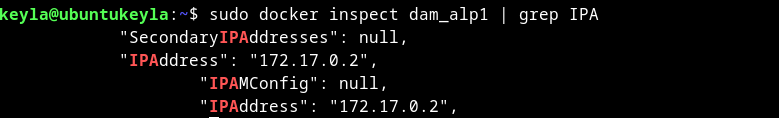

# TAREA 2 

### **Descarga la imagen "alpine" SIN ARRANCARLA y comprueba que está en tu equipo**


```bash
 sudo docker pull alpine 
```
**Comprobar:**
```bash
sudo docker images alpine
```


### **Crea un contenedor sin ponerle nombre. ¿está arrancado? Obtén el nombre**

**Creación del contenedor:**

```bash
docker run -d alpine
```

**Comprobación de si está arrancado:**

```bash
docker ps 
```
(Este comando muestra solo los arrancados, no lo muestra por lo tanto no está arrancado)


**El nombre es *reverent_hodgkin***

### **Crea un contenedor con el nombre 'dam_alp1'. ¿Como puedes acceder a él?**

**Creación del contenedor:**

```bash
sudo docker run -dit --name dam_alp1 alpine
```

**Acceder a el contenedor:**

```bash
sudo docker exec -it dam_alp1 sh
```

### **Comprueba que ip tiene y si puedes hacer un ping a google.com**

**Para comprobar la IP**

Utilizamos el nombre del contenedor: 

```bash
sudo docker inspect dam_alp1 | grep IPA
```



**Para hacer ping a google.com:** 

Se accede al contenedor:
```bash
docker exec -it dam_alp1 sh
```

Se instala iputils para poder hacer el ping:

```bash
apk add iputils
```

Hacemos el ping:

```bash
ping google.com
```


### **Crea un contenedor con el nombre 'dam_alp2'. ¿Puedes hacer ping entre los contenedores?**

**Creación del contendor**

```bash
 sudo docker run -it --name dam_alp2 alpine
```


**¿Podemos hacer ping entre contenedores?**

Sí, para ello utilizaremos el comando ping + la IP que ya habiamos conseguido en el apartado anterior del primer contenedor

```bash
 ping  172.17.0.2 
```

### **Sal del terminal, ¿que ocurrió con el contenedor?**

Para saber que es lo que ocurre con los contenedores podemos utilizar el comando: 

```bash
sudo docker ps -a
```

Este comando nos muestra una tabla con el estado de los contenedores:


### **¿Cuanta memoria en el disco duro ocupaste?**

Con este comando podemos ver una tabla que representa lo que ocupó en nuestro disco duro


```bash
 sudo docker system df
 ```

Esta es la tabla:


### **¿Cuanta RAM ocupan los contenedores? ¿Hay algún comando docker para saber esto?**
Sí, con este comando podemos ver una tabla que representa lo que ocupó en nuestro disco duro


```bash
sudo docker stats
```
Esta es la tabla:


